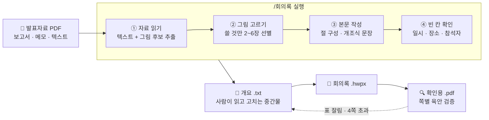
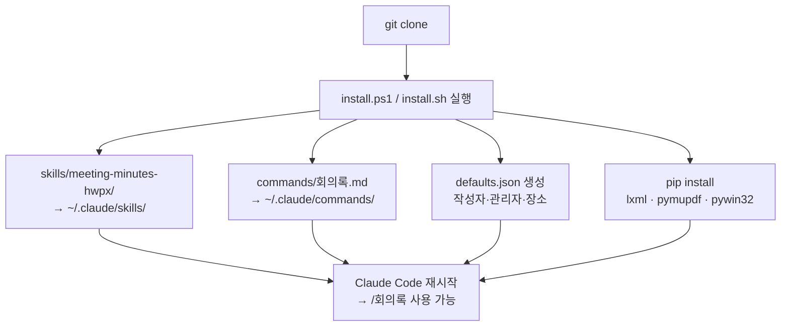
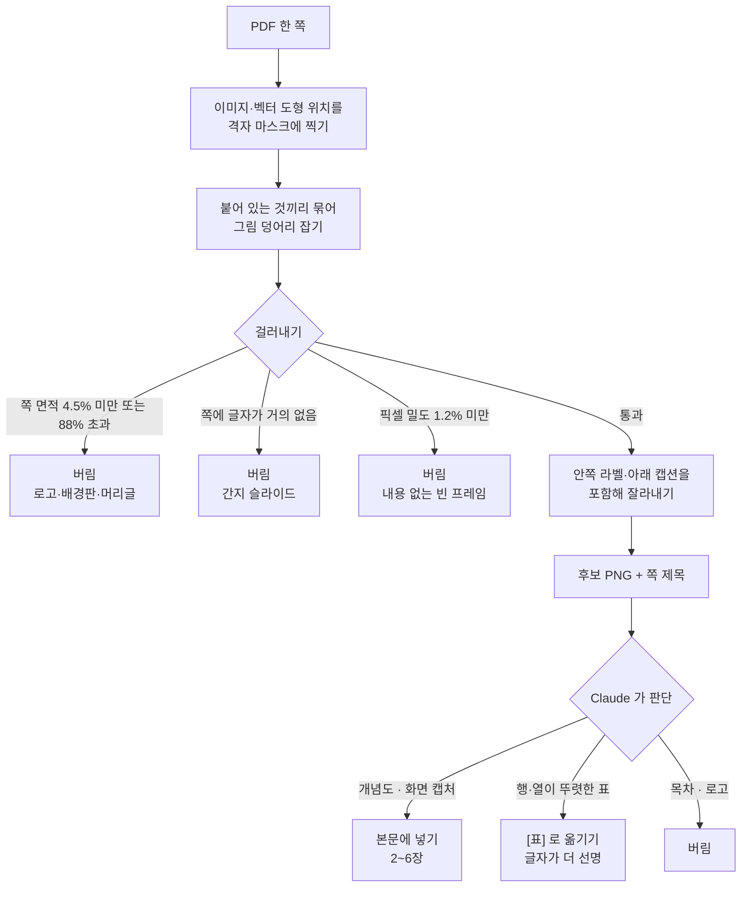
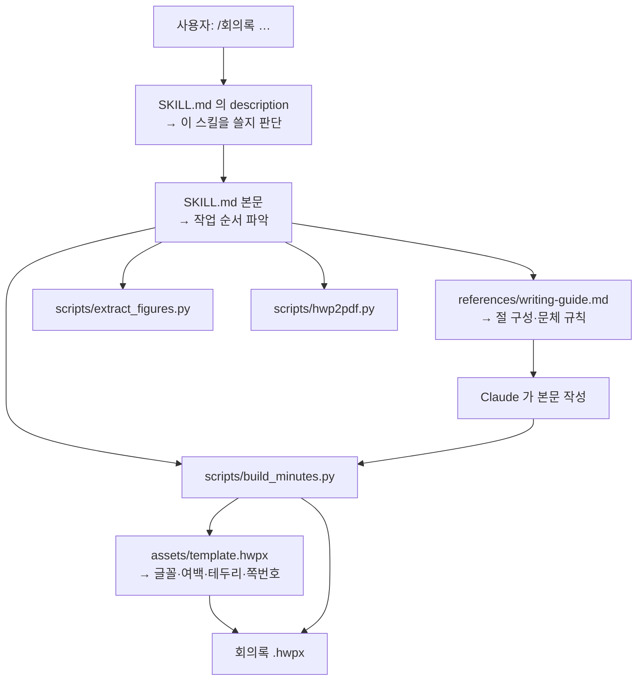

# 회의록 작성 스킬 · `/회의록`

**발표자료 PDF 하나만 주면** 내용을 읽어 본문을 쓰고, PDF 안의 개념도·화면 캡처를
찾아 골라 캡션까지 달아, 행정기관·대학 「회의록」 양식대로 **한글(HWPX)** 문서를 만듭니다.

```
/회의록 ○○ 도입 검토를 위한 간담회   ./발표자료.pdf
        └──────── 제목 ────────┘   └── 자료 ──┘
```

---

## 한눈에 보기



내용을 고치고 싶으면 **개요 `.txt` 만 수정**해 다시 빌드하면 됩니다.
개요 → HWPX 변환은 코드라서 **항상 같은 결과**가 나옵니다.

---

## 만들어지는 문서

```
┌──────────────────────────────────────────────────┐
│                     회 의 록                      │  ← HY헤드라인M 20pt
├────────┬─────────────────────────────────────────┤
│ 제  목 │ ○○ 도입 검토를 위한 간담회               │
├────────┼──────────────────┬─────────┬────────────┤
│ 일  시 │ 2026년 3월 4일   │ 작 성 자 │ 홍길동      │
├────────┼──────────────────┼─────────┼────────────┤
│ 장  소 │ ○○관 ○○○호      │ 관 리 자 │ 김철수      │
├────────┼──────────────────┴─────────┴────────────┤
│ 참 석 자│ (○○본부) 팀장 김철수, 이영희             │
│        │ 주무관 홍길동, 정수민, 최지훈             │
├────────┴─────────────────────────────────────────┤
│ ■ 회의 내용                                       │
│                                                  │
│ 1. 회의 목적                     ← 휴먼명조 14pt 굵게│
│  ◦ 부서별 운영 현황을 공유하고 …   ← 12pt, 내어쓰기   │
│                                                  │
│ 2. 주요 논의 사항                                  │
│  가. 운영 현황                    ← 13pt 굵게       │
│  ◦ (창구 분산) 예약이 부서별로 …   ← (라벨)만 굵게    │
│    - 승인 절차 구분                                │
│      ○ 자동 확정 자원과 승인 필요 자원을 구분         │
│  ┌──────────┬──────────────┬──────────┐          │
│  │   구분    │     자원      │ 보유 수량 │ ← 연청 머리행│
│  ├──────────┼──────────────┼──────────┤          │
│  │ 교육시설  │ 강의실·실습실  │  000실   │          │
│  ├──────────┼──────────────┼──────────┤          │
│  │   합계    │              │  000건   │ ← 음영+굵게 │
│  └──────────┴──────────────┴──────────┘          │
│  ※ 수량은 예시값                  ← 10pt          │
│                                                  │
│  ┌────────────┐      ┌────────────┐              │
│  │  [그림 1]   │      │  [그림 2]   │ ← 한 줄 2장   │
│  └────────────┘      └────────────┘              │
│    [예약 화면]          [승인 화면]                 │
│                                                  │
│                      - 1 -                       │  ← 2쪽부터 쪽번호
└──────────────────────────────────────────────────┘
```

글꼴·여백·테두리·쪽번호는 `assets/template.hwpx`(원본 양식)에서 그대로 가져옵니다.
본문이 길어지면 여러 쪽으로 자동 분리됩니다.

---

## 설치



### 1단계 — 내려받기

```bash
git clone https://github.com/noheunyu1126-spec/claude-meeting-minutes-hwpx.git
cd claude-meeting-minutes-hwpx
```

또는 저장소 페이지에서 **Code ▸ Download ZIP** 으로 받아 압축을 풉니다.

> **비공개 저장소입니다.** GitHub 로그인이 필요하고 초대받은 협업자(Collaborator)만
> 접근할 수 있습니다. `git clone` 이 인증을 물으면
> [GitHub CLI](https://cli.github.com) 를 설치해 `gh auth login` 한 번 해두면
> 이후 자동으로 처리됩니다.

### 2단계 — 설치

```powershell
# Windows
powershell -ExecutionPolicy Bypass -File install.ps1
```

```bash
# macOS / Linux
bash install.sh
```

이미 있는 파일은 **덮어쓰기 전에 물어봅니다.** `defaults.json` 은 보존됩니다.

<details>
<summary>직접 복사하려면</summary>

```
:: Windows
xcopy /E /I skills\meeting-minutes-hwpx "%USERPROFILE%\.claude\skills\meeting-minutes-hwpx"
copy commands\회의록.md "%USERPROFILE%\.claude\commands\"
copy "%USERPROFILE%\.claude\skills\meeting-minutes-hwpx\defaults.example.json" ^
     "%USERPROFILE%\.claude\skills\meeting-minutes-hwpx\defaults.json"
```

```bash
# macOS / Linux
mkdir -p ~/.claude/skills ~/.claude/commands
cp -R skills/meeting-minutes-hwpx ~/.claude/skills/
cp commands/회의록.md ~/.claude/commands/
cp ~/.claude/skills/meeting-minutes-hwpx/defaults{.example,}.json
pip install lxml pymupdf pywin32
```
</details>

설치 후 구조는 이렇게 됩니다.

```
~/.claude/
├─ commands/
│  └─ 회의록.md                  ← /회의록 커맨드
└─ skills/meeting-minutes-hwpx/
   ├─ SKILL.md                  ← 최상단에 있어야 스킬로 인식됩니다
   ├─ defaults.json             ← 작성자·관리자·장소 (직접 채우기)
   ├─ assets/
   │  └─ template.hwpx          ← 양식 원본. 없으면 아무것도 안 됩니다
   ├─ references/writing-guide.md
   ├─ examples/
   └─ scripts/
      ├─ build_minutes.py       개요 → HWPX
      ├─ extract_figures.py     PDF → 텍스트 + 그림
      └─ hwp2pdf.py             HWPX → PDF (검증)
```

### 3단계 — 기본값 채우기

`~/.claude/skills/meeting-minutes-hwpx/defaults.json` 을 열어 소속에 맞게 고칩니다.
여기에 적어 두면 매번 다시 입력하지 않아도 되고, 비어 있는 칸만 물어봅니다.

```json
{
  "author":    "작성자 이름",
  "manager":   "관리자 이름",
  "location":  "○○관 ○○○호",
  "attendees": ["(○○본부) 팀장 …", "주무관 …"]
}
```

실명이 들어가므로 `.gitignore` 로 제외되어 저장소에 올라가지 않습니다.

### 4단계 — 확인

Claude Code 를 다시 시작하고 `/회의록` 을 입력합니다.
빌드만 따로 확인하려면:

```bash
cd ~/.claude/skills/meeting-minutes-hwpx
python scripts/build_minutes.py --selftest -o 확인.hwpx
```

`"PASS": true` 가 나오면 정상입니다.

---

## 쓰는 방법

```
/회의록 [회의 제목] [자료 파일·폴더 경로…]
```

| 입력 | 동작 |
|---|---|
| `/회의록 ○○ 간담회 ./자료.pdf` | 제목과 자료를 주고 바로 작성 |
| `/회의록 ○○ 간담회 ./자료폴더/` | 폴더 안의 PDF·HWP·PPT·TXT 를 전부 훑음 |
| `/회의록` | 현재 폴더에서 회의록 없는 자료 폴더를 찾아 후보를 보여줌 |
| `/회의록 ./개요.txt` | 이미 만든 개요로 본문 작성을 건너뛰고 바로 빌드 |

일시·장소·참석자처럼 자료에 없는 칸은 **한 번에 모아** 물어봅니다.
`defaults.json` 이 채워 주는 칸은 묻지 않습니다.

### 결과물

자료가 있던 폴더에 다음이 생깁니다.

```
<회의명>_회의록_<YYYYMMDD>_<작성자>.hwpx    ← 결과물
<회의명>_회의록_<YYYYMMDD>_<작성자>.pdf     ← 확인용
개요.txt                                  ← 고칠 때 이 파일만 수정
그림/                                     ← 쓴 그림 원본
```

---

## 발표자료 PDF 에서 그림을 고르는 방식



`scripts/extract_figures.py` 가 만드는 것:

| 산출물 | 용도 |
|---|---|
| `text.md` | 쪽별 제목·본문·그림 후보 목록 → 내용 파악 |
| `fig_p17_1.png` | 잘라낸 그림 → `[그림]` 줄에 그대로 씀 |
| `figures.json` | 쪽·크기·`ink`(내용 밀도)·주변 문구 |
| `pages/p17.png` | 쪽 전체 렌더 → 맥락 확인 |

발표자료 폰트가 괄호·화살표를 CJK 호환 문자로 심어 둔 경우(`㏙2단계㏚`)를 되돌리고,
뜻이 애매한 글자는 **손대지 않고 보고**합니다.

---

## 개요 파일 문법

`/회의록` 이 이 형식으로 개요를 만들고, 사람이 고쳐서 다시 빌드할 수 있습니다.

```
제목: 통합 예약시스템 도입 검토를 위한 간담회
일시: 2026년 3월 4일 14시
참석자: (○○본부) 팀장 김철수, 이영희
참석자: 주무관 홍길동, 정수민, 최지훈

1. 회의 목적
◦ 부서별 운영 현황을 공유하고 추진방향 논의

2. 주요 논의 사항
가. 운영 현황
◦ (창구 분산) 예약이 부서별 게시판과 전화로 나뉘어 처리되고 있음
  - 승인 절차 구분
    ○ 자동 확정 자원과 승인 필요 자원을 구분해 설정
※ 공동장비는 2차년도로 분리 추진

[표] 자원 보유 및 예약 창구 현황
구분 | 자원 | 보유 수량
교육시설 | 강의실 · 실습실 | 000실
=합계 | | 000건
[끝]

[그림] 화면1.png | 화면2.png
[캡션] 예약 화면 | 승인 화면
```

기호가 문서 요소로 어떻게 대응되는지:

```
1.  ────────────▶  절 표제        휴먼명조 14pt 굵게
가. ────────────▶  소제목         13pt 굵게
□   ────────────▶  대주제         15pt 굵게
◦   ────────────▶  글머리         12pt, (라벨)만 굵게, 내어쓰기
  - ────────────▶  하위 글머리
    ○ ──────────▶  세부 글머리
※   ────────────▶  단서·근거      10pt
**굵게** ───────▶  본문 중간 강조

[표] … [끝]  ──▶  연청 머리행 표   열 폭·정렬 자동 계산
  = (행 앞)  ──▶  합계행          음영 + 굵게
  ^ (칸)     ──▶  위 칸과 세로 병합
[그림]/[캡션] ─▶  한 줄 1~2장 + 대괄호 캡션
#   ────────────▶  주석           문서에 나오지 않음
```

기호 없이 들여쓰기만 해도 깊이를 판단합니다(3칸 이상 `-`, 6칸 이상 `○`).

---

## 스킬은 어떻게 동작하나

**스킬은 학습(파인튜닝)이 아니라 파일 묶음입니다.** 모델을 바꾸는 것이 아니라,
Claude 가 읽을 지시문과 실행할 코드를 폴더에 담아 둔 것입니다.



### 이 폴더만 있으면 됩니다

스킬을 만들 때 참고했던 원본 자료(기존 회의록, 원본 양식 파일 등)는
**실행 시점에 전혀 읽지 않습니다.** 필요한 것은 이미 폴더 안에 들어와 있습니다.

| 스킬 폴더 안 파일 | 원래 무엇이었나 | 실행에 필요한가 |
|---|---|---|
| `assets/template.hwpx` | **원본 양식에서 내용만 비운 사본** | **필수** — 모든 서식이 여기서 나옴 |
| `SKILL.md` | 작업 순서·입력 형식 명세 | **필수** — 이게 없으면 스킬이 아님 |
| `scripts/` | 실제로 문서를 만드는 코드 | **필수** |
| `references/writing-guide.md` | 기존 회의록들을 읽고 정리한 작성 규칙 | 필요 — 본문 설계 때 읽음 |
| `examples/` | 입력 형식 예시(가상 내용) | 선택 — 참고용 |

즉 **원본 자료 폴더는 지워도 되고, 다른 PC 로 옮겨도 됩니다.**

### 본문 문장은 매번 달라집니다

서식·구조·문체 규칙은 이 폴더가 제공하고, **문장 자체는 그때 준 자료를 Claude 가
읽고 새로 씁니다.** 확정된 문안을 다시 쓰려면 **개요 `.txt` 를 보관**하세요.

```
자료 ──Claude──▶ 개요.txt ──코드──▶ HWPX
      매번 다름           항상 같음
```

---

## 서식을 원본과 같게 유지하는 방법

HWPX 는 zip 안에 XML 이 들어 있는 형식입니다. 서식 자원을 새로 만들지 않고
`assets/template.hwpx` 의 것을 그대로 참조합니다.

```
template.hwpx (zip)
├─ Contents/header.xml     글꼴·글자·문단·테두리 정의
│     └─ 그대로 두고 본문용 자원만 추가
│        (borderFill 1개 · charPr 8개 · paraPr 10개)
├─ Contents/section0.xml   본문
│     ├─ secPr             용지·여백·쪽번호  → 손대지 않음
│     ├─ 표제 박스          「회의록」        → 손대지 않음
│     ├─ 제목표 값 셀 6개                    → 교체
│     └─ 본문 셀 (r7c0)                     → 교체
└─ BinData/                그림              → 추가 + content.hpf 에 등록
```

그래서 글꼴·여백·테두리·색상·쪽번호가 원본 양식과 일치합니다.

### 다른 양식으로 바꾸기

`assets/template.hwpx` 를 쓰려는 양식으로 교체하면 됩니다. 단, 제목표가
`4열 × 9행` 한 표이고 본문이 `r7c0` 셀이라는 구조를 전제로 하므로, 구조가 다르면
`scripts/build_minutes.py` 상단의 자원 ID 상수와 셀 좌표를 맞춰야 합니다.

---

## 요구사항

| | |
|---|---|
| **한컴오피스 한글** | 결과 확인·PDF 변환에 필요(Windows). **LibreOffice 는 HWPX 를 읽지 못합니다** |
| **Python 3.10+** | `lxml`, `PyMuPDF`, `pywin32`(PDF 변환) |
| **Claude Code** | `/회의록` 실행 |

---

## 알아둘 것

- **표·그림이 쪽 경계에 걸리면** 한글이 통째로 다음 쪽으로 넘겨 앞 쪽 아래가 비어
  보일 수 있습니다. 확인용 PDF 를 보고 절 순서나 그림 위치를 조정하세요.
- **행·열이 뚜렷한 표 그래픽은 그림으로 넣지 말고** `[표]` 로 옮기세요.
  글자가 훨씬 선명하고 쪽 경계에서도 잘 흐릅니다.
- **회의 중 발언을 그대로 옮기지 않습니다.** 논의 *결과*를 개조식 명사종결로 적습니다
  ("…필요", "…논의", "…확정"). 참석자 개인 이름은 제목표에만 넣습니다.
- **자료에 없는 내용은 만들지 않습니다.** 확인이 필요한 항목은 「검토 필요사항」 절에
  "…별도 확인 필요" 로 남깁니다.
- **회의록은 2~3쪽이 표준입니다.** 4쪽을 넘으면 내용을 줄이는 편이 좋습니다.
- 그림 렌더 크기는 `hp:imgRect × (curSz / orgSz)` 로 결정됩니다. `imgRect` 는
  원본 크기, `curSz`/`hp:sz` 는 표시 크기로 두어야 합니다.

---

## 예시에 대하여

`examples/` 와 이 문서의 모든 회의 내용·이름·기관·수치는 **기능 확인용으로 지어낸
가상 예시**입니다. 실제 회의 내용이나 담당자 정보는 포함되어 있지 않습니다.
